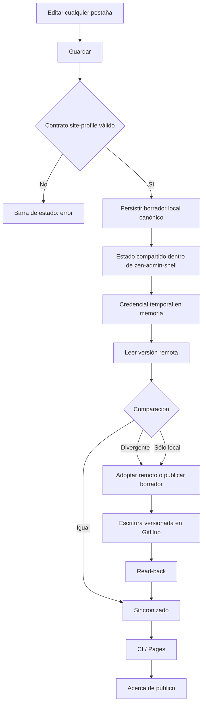

# Wireframes — Admin / Acerca de

## Regla de composición

`#zen-admin-shell` es el único viewport de la experiencia de administración. Ningún control de usuario puede depender de un portal visual fuera de ese contenedor ni provocar scroll horizontal.

- El shell ocupa `100dvw × 100dvh`.
- La cabecera global mantiene accesibles `Acerca de` e `Ir al sitio ↗`.
- En **Acerca de**, las acciones superiores siguen siendo `Vista Previa ↗`, `Exportar` e `Importar`.
- La barra de estado queda siempre entre las acciones y el workspace.
- El workspace de Acerca de se divide en cinco pestañas internas: `Perfil`, `Detalles`, `Intereses`, `Redes` y `Recursos`.
- En desktop/tablet las pestañas forman un rail lateral contenido; en móvil forman una grilla contenida sin scroll horizontal.
- Sólo `.zam-tab-content` desplaza verticalmente el panel activo. La navegación interna, el estado y el footer permanecen estables.
- La acción final sigue siendo `Guardar`: valida el documento local y abre la publicación pública autenticada.
- El diálogo de publicación continúa siendo descendiente DOM de `#zen-admin-shell` y nunca supera el viewport.
- El cambio de pestaña no modifica ni publica el borrador. El estado del formulario se conserva entre secciones.

## Mapa de información

```text
Acerca de / Ir al sitio ↗
 │
 ├─ [Vista Previa ↗]
 ├─ [Exportar]
 ├─ [Importar]
 ├─ Barra de estado
 │
 ├─ Pestañas internas
 │   │
 │   ├─ Perfil
 │   │   └─ Identidad y contacto — Principal
 │   │       ├─ Foto de perfil
 │   │       │   ├─ Se recorta al centro y se optimiza automáticamente.
 │   │       │   ├─ La vista pública usa marco circular.
 │   │       │   ├─ [Subir foto] [Eliminar]
 │   │       │   └─ Foto (URL o data URL)
 │   │       ├─ Nombre visible
 │   │       ├─ Introducción
 │   │       ├─ Correo electrónico
 │   │       ├─ Sitio web
 │   │       └─ Perfil de Blogger
 │   │
 │   ├─ Detalles
 │   │   ├─ Perfil extendido — Acerca de Blogger
 │   │   │   ├─ Ocupación
 │   │   │   ├─ Sector / Industria
 │   │   │   └─ Género
 │   │   ├─ Ubicación — Opcional
 │   │   │   ├─ País
 │   │   │   ├─ Estado / Región
 │   │   │   └─ Ciudad
 │   │   └─ Campos clásicos de Blogger — Perfil público
 │   │       ├─ Audio Clip
 │   │       │   ├─ [Subir audio] [Eliminar]
 │   │       │   └─ Audio Clip (URL o data URL)
 │   │       ├─ Wishlist
 │   │       ├─ Pregunta aleatoria
 │   │       └─ Respuesta
 │   │
 │   ├─ Intereses
 │   │   └─ Intereses y favoritos — Uno por línea
 │   │       ├─ Intereses
 │   │       ├─ Películas favoritas
 │   │       ├─ Música favorita
 │   │       └─ Libro favorito
 │   │
 │   ├─ Redes
 │   │   └─ Redes sociales — Enlaces públicos
 │   │       ├─ [+ Añadir red]
 │   │       └─ Red N [↑] [↓] [Eliminar]
 │   │           ├─ Plataforma
 │   │           │   ├─ X / Twitter
 │   │           │   ├─ YouTube
 │   │           │   ├─ GitHub
 │   │           │   ├─ Facebook
 │   │           │   ├─ Instagram
 │   │           │   ├─ LinkedIn
 │   │           │   ├─ Telegram
 │   │           │   ├─ Bluesky
 │   │           │   └─ Mastodon
 │   │           ├─ Etiqueta personalizada
 │   │           ├─ Usuario
 │   │           ├─ URL
 │   │           └─ Visible
 │   │
 │   └─ Recursos
 │       └─ Recursos relacionados — Directorio editorial
 │           ├─ [+ Añadir recurso]
 │           └─ Recurso N [↑] [↓] [Eliminar]
 │               ├─ Título
 │               ├─ URL
 │               ├─ Descripción
 │               ├─ Tipo
 │               │   ├─ Proyecto
 │               │   ├─ Institución
 │               │   ├─ Archivo
 │               │   ├─ Fuente
 │               │   ├─ Publicación
 │               │   └─ Recurso
 │               └─ Visible
 │
 └─ [Guardar] — Publicación pública autenticada
```

## Flujo de navegación interna

Las pestañas usan el patrón ARIA `tablist` / `tab` / `tabpanel`.

- La pestaña activa usa `aria-selected="true"` y es la única con `tabIndex=0`.
- `ArrowLeft` y `ArrowRight` cambian y enfocan la pestaña anterior/siguiente.
- `Home` activa la primera pestaña.
- `End` activa la última pestaña.
- Sólo un `tabpanel` está visible a la vez.
- Cambiar de pestaña nunca descarta `draft`, foto, audio, redes ni recursos.

## Flujo de publicación



## Wireframe desktop

```text
┌────────────────────────────────────────────────────────────────────────────────────┐
│ HR ZenBlog Admin       Metadata | Search Lab | Acerca de   Compartido  Ir al sitio↗ │
├────────────────────────────────────────────────────────────────────────────────────┤
│ Acerca de / Perfil                              Vista Previa ↗ | Exportar | Importar │
├────────────────────────────────────────────────────────────────────────────────────┤
│ Estado: cambios locales pendientes / validado / error                              │
├───────────────────┬────────────────────────────────────────────────────────────────┤
│ Perfil            │ Perfil                                                          │
│ Identidad/contacto│ Identidad editorial                                             │
│                   │ Todos los campos pertenecen al documento compartido.            │
│ Detalles          │                                                                │
│ Blogger/ubicación │ ┌ Identidad y contacto ─────────────────────── Principal ──┐    │
│                   │ │ Foto circular   [Subir foto] [Eliminar]                   │    │
│ Intereses         │ │ Foto URL/data   [____________________________________]    │    │
│ Gustos/favoritos  │ │ Nombre visible  [____________________________________]    │    │
│                   │ │ Introducción    [____________________________________]    │    │
│ Redes          3  │ │ Correo          [____________________________________]    │    │
│ Enlaces públicos  │ │ Sitio web       [____________________________________]    │    │
│                   │ │ Blogger         [____________________________________]    │    │
│ Recursos       2  │ └───────────────────────────────────────────────────────────┘    │
│ Directorio        │                                                ↕ panel activo    │
├───────────────────┴────────────────────────────────────────────────────────────────┤
│ Publicación pública autenticada                                      [ Guardar ]    │
└────────────────────────────────────────────────────────────────────────────────────┘
```

## Wireframe móvil

```text
┌──────────────────────────────┐
│ HR Admin  Compartido  Sitio↗ │
├──────────────────────────────┤
│ Metadata │ Search │ Acerca   │
├──────────────────────────────┤
│ Vista Previa │ Exportar │Imp.│
├──────────────────────────────┤
│ Barra de estado              │
├──────────────────────────────┤
│ Perfil   │ Detalles │Interés │
│ Redes    │ Recursos │        │
├──────────────────────────────┤
│ Panel activo                 │
│                              │
│ Identidad y contacto         │
│ Principal                    │
│                              │
│ ( Foto )                     │
│ [Subir foto]   [Eliminar]    │
│ URL/data [_______________]   │
│                              │
│ Nombre [_________________]   │
│ Introducción                 │
│ [________________________]   │
│                    ↕ interno │
├──────────────────────────────┤
│ Publicación autenticada      │
│ [          Guardar         ] │
└──────────────────────────────┘

← nunca scroll horizontal →
```

## Criterios de aceptación UX

1. Cero scroll horizontal en `#zen-admin-shell`, Acerca de, acciones, pestañas internas, panel activo y footer.
2. `Vista Previa ↗`, `Exportar`, `Importar` y `Guardar` permanecen dentro del viewport en desktop, tablet y móvil.
3. Las cinco pestañas internas permanecen visibles y contenidas; móvil no depende de un carrusel horizontal para encontrarlas.
4. Sólo un panel se presenta a la vez, reduciendo densidad cognitiva sin eliminar campos ni capacidades.
5. Todos los campos del flujo anterior siguen disponibles en su pestaña correspondiente.
6. `Guardar` sigue siendo el único CTA de publicación y abre el flujo autenticado compartido.
7. Foto y Audio Clip admiten carga local, eliminación y fuente URL/data URL según su política de seguridad.
8. Redes y recursos conservan alta, eliminación, visibilidad y orden explícito con controles ↑ / ↓.
9. La vista pública omite campos vacíos.
10. El diálogo de publicación nunca supera el viewport y continúa dentro de `#zen-admin-shell`.
11. Desktop, tablet y móvil mantienen accesibles las tres herramientas globales.
12. El patrón de pestañas es operable con teclado y mantiene foco/selección sincronizados.
13. Axe WCAG 2.2 AA debe permanecer sin violaciones en el shell de Acerca de.
