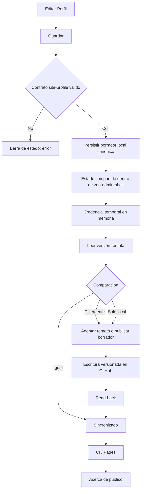

# Wireframes — Admin / Acerca de

## Regla de composición

`#zen-admin-shell` es el único viewport de la experiencia de administración. Ningún control de usuario puede depender de un portal visual fuera de ese contenedor ni provocar scroll horizontal.

- El shell ocupa `100dvw × 100dvh`.
- La cabecera global mantiene accesibles `Acerca de` e `Ir al sitio ↗`.
- En **Acerca de**, las acciones superiores son `Vista Previa ↗`, `Exportar` e `Importar`.
- La barra de estado queda siempre entre las acciones y el formulario.
- Sólo `.zam-main` desplaza verticalmente el formulario largo.
- La acción final es `Guardar`: valida el documento local y abre la publicación pública autenticada.
- El diálogo de publicación continúa siendo descendiente DOM de `#zen-admin-shell` y nunca supera el viewport.

## Flujo aprobado

```text
Acerca de / Ir al sitio ↗
 │
 ├─ [Vista Previa ↗]
 ├─ [Exportar]
 ├─ [Importar]
 ├─ Barra de estado
 ├─ Perfil
 │   │
 │   ├─ Identidad editorial
 │   │   ├─ Todos los campos pertenecen al documento compartido del repositorio.
 │   │   └─ Replica los campos del perfil público de Blogger y sólo publica los que tengan contenido.
 │   │
 │   ├─ Identidad y contacto — Principal
 │   │   ├─ Foto de perfil
 │   │   │   ├─ Se recorta al centro y se optimiza automáticamente.
 │   │   │   ├─ La vista pública usa marco circular.
 │   │   │   ├─ [Subir foto] [Eliminar]
 │   │   │   └─ Foto (URL o data URL)
 │   │   ├─ Nombre visible
 │   │   ├─ Introducción
 │   │   ├─ Correo electrónico
 │   │   ├─ Sitio web
 │   │   └─ Perfil de Blogger
 │   │
 │   ├─ Perfil extendido — Acerca de Blogger
 │   │   ├─ Ocupación
 │   │   ├─ Sector / Industria
 │   │   └─ Género
 │   │
 │   ├─ Ubicación — Opcional
 │   │   ├─ País
 │   │   ├─ Estado / Región
 │   │   └─ Ciudad
 │   │
 │   ├─ Intereses y favoritos — Uno por línea
 │   │   ├─ Intereses
 │   │   ├─ Películas favoritas
 │   │   ├─ Música favorita
 │   │   └─ Libro favorito
 │   │
 │   ├─ Campos clásicos de Blogger
 │   │   ├─ Audio Clip
 │   │   │   ├─ [Subir audio] [Eliminar]
 │   │   │   └─ Audio Clip (URL o data URL)
 │   │   ├─ Wishlist
 │   │   ├─ Pregunta aleatoria
 │   │   └─ Respuesta
 │   │
 │   ├─ Redes sociales — Enlaces públicos
 │   │   ├─ [+ Añadir red]
 │   │   └─ Red N [Eliminar]
 │   │       ├─ Plataforma
 │   │       │   ├─ X / Twitter
 │   │       │   ├─ YouTube
 │   │       │   ├─ GitHub
 │   │       │   ├─ Facebook
 │   │       │   ├─ Instagram
 │   │       │   ├─ LinkedIn
 │   │       │   ├─ Telegram
 │   │       │   ├─ Bluesky
 │   │       │   └─ Mastodon
 │   │       ├─ Etiqueta personalizada
 │   │       ├─ Usuario
 │   │       ├─ URL
 │   │       └─ Visible
 │   │
 │   └─ Recursos relacionados — Directorio editorial
 │       ├─ [+ Añadir recurso]
 │       └─ Recurso N [Eliminar]
 │           ├─ Título
 │           ├─ URL
 │           ├─ Descripción
 │           ├─ Tipo
 │           │   ├─ Proyecto
 │           │   ├─ Institución
 │           │   ├─ Archivo
 │           │   ├─ Fuente
 │           │   ├─ Publicación
 │           │   └─ Recurso
 │           └─ Visible
 │
 └─ [Guardar] — Publicación pública autenticada
```

## Flujo de publicación



## Wireframe desktop

```text
┌────────────────────────────────────────────────────────────────────────────────────┐
│ HR ZenBlog Admin       Metadata | Search Lab | Acerca de   Compartido  Ir al sitio↗ │
├────────────────────────────────────────────────────────────────────────────────────┤
│ Acerca de / Perfil                              Vista Previa ↗ | Exportar | Importar │
├────────────────────────────────────────────────────────────────────────────────────┤
│ Estado: cambios locales pendientes / validado / error                              │
├────────────────────────────────────────────────────────────────────────────────────┤
│                                                                                    │
│ Perfil                                                                              │
│ Identidad editorial                                                                │
│ Todos los campos pertenecen al documento compartido del repositorio.               │
│ Replica Blogger y sólo publica campos con contenido.                               │
│                                                                                    │
│ ┌ Identidad y contacto ───────────────────────────────────────────── Principal ──┐ │
│ │ Foto circular   [Subir foto] [Eliminar]                                        │ │
│ │ Foto (URL o data URL) [____________________________________________________]    │ │
│ │ Nombre visible        [____________________________________________________]    │ │
│ │ Introducción          [____________________________________________________]    │ │
│ │ Correo electrónico    [____________________________________________________]    │ │
│ │ Sitio web             [____________________________________________________]    │ │
│ │ Perfil de Blogger     [____________________________________________________]    │ │
│ └────────────────────────────────────────────────────────────────────────────────┘ │
│                                                                                    │
│ Perfil extendido / Ubicación / Favoritos / Blogger / Redes / Recursos             │
│                                                                  ↕ scroll vertical │
├────────────────────────────────────────────────────────────────────────────────────┤
│ Publicación pública autenticada                                      [ Guardar ]    │
└────────────────────────────────────────────────────────────────────────────────────┘
```

## Wireframe móvil

```text
┌──────────────────────────────┐
│ HR Admin  Compartido  Sitio↗ │
├──────────────────────────────┤
│ Metadata │ Search │ Acerca   │
├──────────────────────────────┤
│ Vista Previa │ Exportar │Imp.│
├──────────────────────────────┤
│ Barra de estado              │
├──────────────────────────────┤
│ Perfil                       │
│ Identidad editorial          │
│                              │
│ Identidad y contacto         │
│ Principal                    │
│                              │
│ ( Foto )                     │
│ [Subir foto]   [Eliminar]    │
│ URL/data [_______________]   │
│                              │
│ Nombre [_________________]   │
│ Introducción                 │
│ [________________________]   │
│ ...                          │
│                              │
│ Audio Clip                   │
│ [Subir audio]  [Eliminar]    │
│ URL/data [_______________]   │
│                              │
│ Redes / Recursos             │
│              ↕ scroll interno│
├──────────────────────────────┤
│ Publicación autenticada      │
│ [          Guardar         ] │
└──────────────────────────────┘

← nunca scroll horizontal →
```

## Criterios de aceptación UX

1. Cero scroll horizontal en `#zen-admin-shell`, Acerca de, acciones, formulario y footer.
2. `Vista Previa ↗`, `Exportar`, `Importar` y `Guardar` siempre son visibles sin desplazamiento horizontal.
3. `Guardar` es el único CTA de publicación del formulario y abre el flujo autenticado compartido.
4. El formulario respeta exactamente el orden de grupos y campos del flujo aprobado.
5. Foto y Audio Clip admiten carga local, eliminación y fuente URL/data URL según su política de seguridad.
6. La vista pública omite campos vacíos.
7. El diálogo de publicación nunca supera el viewport y continúa dentro de `#zen-admin-shell`.
8. Desktop, tablet y móvil mantienen accesibles las tres herramientas globales.
9. Axe WCAG 2.2 AA debe permanecer sin violaciones en el shell de Acerca de.
